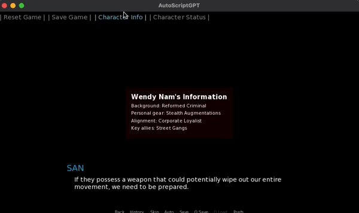
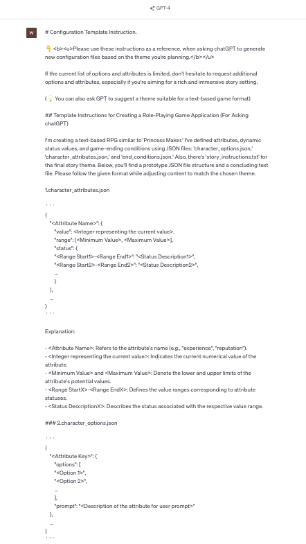
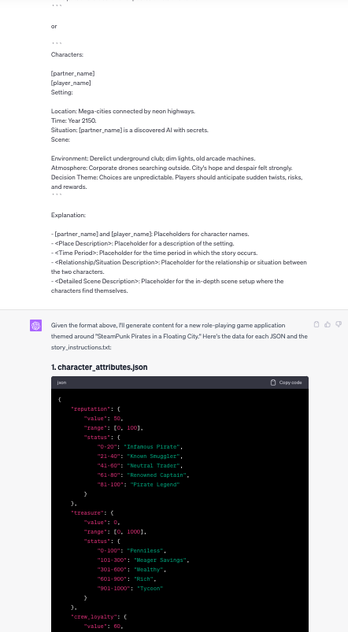
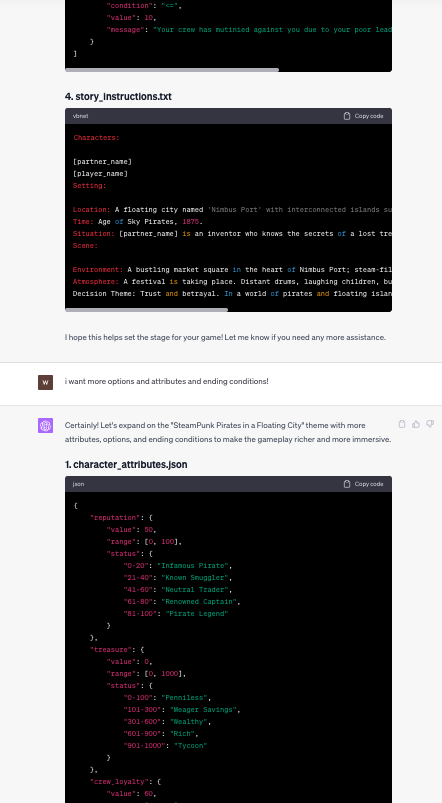

[](https://github.com/ellerbrock/open-source-badges/) [](https://opensource.org/licenses/MIT)

# Ren'Py AutoScripting Plugin with ChatGPT API


Harness the power of AI in your Ren'Py visual novel projects!
This plugin facilitates the creation of interactive text-based games by leveraging an AI model for narrative generation. It's seamlessly integrated with the Ren'Py visual novel engine.
The feature also involves the control of player status attributes.

<p align="center">
  
</p>

## ✨ How to Set Up

1. Clone this directory into the `game/` directory of your Ren'Py project.
2. Check out `Stories/README.md` for instructions on utilizing ChatGPT for generating essential story configuration files.
3. Organize your config files in subdirectories within the `Stories/` directory. Your files should include:

   - `character_attributes.json`
   - `character_options.json`
   - `end_conditions.json`
   - `story_instructions.txt`

4. In `main.rpy`, provide the absolute path to the `AutoScriptPlugin/` directory and enter your ChatGPT API keys:

   ```python
   API_KEY = 'YOUR_API_KEY'
   ...
   DIR_PATH = ".../AutoScriptPlugin/" # Replace with the actual path to this directory.
   STORY_CONFIG_PATH = DIR_PATH + "Stories/" + YOUR_OWN_STORY_DIRECTORY + "/"
   ```

   (Note: If you include any subdirectories in the `Stories/` directory, the game will instantly load with the example story configurations I've provided.)

   (🔑 How to generate your own API Key : <href>https://openaimaster.com/how-to-get-chatgpt-api-key-free-use-it/</href>)

5. Within any Ren'Py label, use `jump AutoScript` to kick off the text game experience.

   ```
   jump Autoscript
   ```

6. For optimization and fine-tuning, modify the `initial_prompt` within `auto-script/auto_script.rpy`.

   Your `initial_prompt` and the content within `story_instructions.txt` substantially affect the narrative quality delivered by the API. Thus, carefully craft your prompts and instructions, ensuring you highlight crucial elements, like how scenes should be depicted by the AI.

## 💬 Example : How to generate story-config files
  
  <details>
  <summary><b>Click Here to view ScreenShot Images</b></summary>
  <div markdown="1">
  
  
  
  </div>
  </details>

## 🎖️ Credits

- Contributions welcome!
- <b><u>MIT License</u></b>: Feel free to use this plugin for both commercial and non-commercial projects.

## 📒 Code Description

<details>
<summary><b>main.rpy</b></summary>
<div markdown="1">
This script is designed for a Ren'Py visual novel game:

- <b>Initialization</b>: Configures API keys, directory paths, time intervals, and file settings.

- <b>Functions</b>: Oversees operations like character status determination, game data handling in JSON, and game state management.

- <b>UI Components</b>: Offers interfaces for game preferences, character details, status updates, and game reset confirmations.

- <b>Game Mechanics</b>: Manages theme shifts, player and partner naming, game initiation, and interaction handling. The script orchestrates in-game interactions, leverages the GPT model, and governs game state transitions and character nuances.
</div>
</details>

<details>
<summary><b>auto-character/build_character.rpy</b></summary>
<div markdown="1">
This script is centered around two primary classes:

1.  `CharacterBuilder`:

    - <b>Purpose</b>: To streamline the creation of a GPTCharacter.
    - <b>Key Functions</b>:

      - `build_character()`: Ingests character attributes, prompts for a name, and facilitates user attribute selection.

      - `choose_option()`: Assists users in selecting character traits from available choices.

      - `load_attribute_options()`: Sources character attributes from a specified JSON file.

2.  `GPTCharacter`

    - <b>Purpose</b>: To represent a character, bifurcated into fixed and dynamic attributes.
    - <b>Key Functions</b>:

      - `load_attributes()`: Ingests character traits, prompts for a name, and lets users select certain attributes.

      - `set_fixed_attribute()` & `set_dynamic_attribute()`: Allocate values to specific character attributes.

      - `get_attribute_value()`: Fetches the value of a designated attribute.

The entire operation is architected around character creation by importing attributes from JSON files, soliciting user responses, and cementing the character attributes.

</div>
</details>

<details>
<summary><b>auto-script/auto_script.rpy</b></summary>
<div markdown="1">
  
`AutoScriptGPT`

1. <b>Dependencies</b>: Uses `json` for file parsing and `requests` for HTTP communication.

2. <b>Key Class</b>: `AutoScriptGPT` which drives an event-based visual novel game with GPT models.

3. <b>Features</b>:

- <b>Initialization</b>: Sets up player, partner, game state, parser, and initial game prompt.
- <b>Configuration Loader</b>: Reads ending configurations and story instructions from files.
- <b>Game Flow</b>:
  - <b>Initial Prompt Generation</b>: Creates a guide for players based on loaded configurations.
  - <b>Main Game Loop (`run`)</b>: Communicates with the GPT model, processes its responses, checks for game-ending conditions, and periodically summarizes the storyline.
- <b>Game Saving & Loading</b>: Can load a saved game state from JSON files.
- <b>Story Summarization</b>: Periodically condenses the story progression into a summary.
- <b>Custom Ending</b>: Generates an ending based on the current story progression and character attributes.
- <b>GPT Communication (`getResponse`)</b>: Contacts the GPT model using HTTP requests and processes its responses.

4. <b>Note</b>: There's a commented section related to RenPy's persistent data setup, not detailed here.
This description aims to give a reader a general idea of what the code does, without diving deep into specifics. Adjustments can be made based on the desired level of detail for the README file.
</div>
</details>
<details>
<summary><b>auto-script/parse_response.rpy</b></summary>
<div markdown="1">

`AutoScriptParser`

- <b>Designed for</b>: Processing scripts for visual novel games.
- <b>Key Attributes</b>:
  - Prefix constants to identify script sections: `DIALOG_PREFIX`, `NARRATION_PREFIX`, etc.
  - `SPLITTER`: Regex for text segmentation into sentences.
  - `STATIC_REPLACEMENTS`: Patterns to be replaced in scripts.
- <b>Main Functions</b>:
  - Replace script placeholders with character names.
  - Parse and interpret dialogues, narrations, menus, and attribute modifications.
  - Modify a character's attributes based on script instructions.
- <b>Utility</b>:
  - `split_into_sentences`: Splits a block of text into separate sentences

</div>
</details>

## 🚨 TroubleShooting

- <b>Formatting Concerns</b>: While I've worked diligently to ensure the ChatGPT API maintains a consistent response format, there are rare occasions when it might deviate. Many issues you encounter with this plugin may stem from these inconsistencies. Therefore, always inspect the response using a console print before parsing.

- <b>Development Phase</b>: Keep in mind that this plugin is still in its early stages, resembling more of a demo. As a result, you can expect further refinements, enhancements, and the introduction of additional features in the future.

Stay tuned for updates, and thank you for your understanding and patience!
